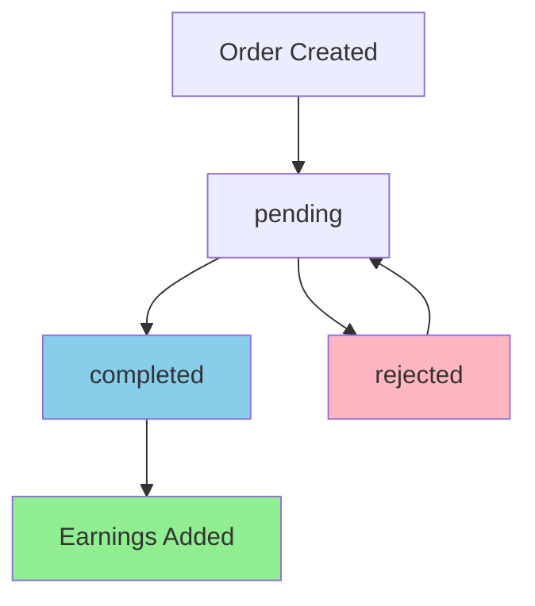

# Designer Earnings Process Flow Documentation
## Rachmat System - Complete Guide

### Table of Contents
1. [Overview](#overview)
2. [Database Schema](#database-schema)
3. [Order Status Flow](#order-status-flow)
4. [Earnings Calculation](#earnings-calculation)
5. [Multi-Designer Orders](#multi-designer-orders)
6. [Admin Management](#admin-management)
7. [Edge Cases](#edge-cases)
8. [Code References](#code-references)

---

## Overview

The Rachmat system implements a **100% designer earnings model** where designers receive the full order amount without platform commission deduction. The system tracks both **unpaid earnings** (accumulated from completed orders) and **paid earnings** (amounts already transferred to designers).

### Key Principles
- ✅ **100% to Designer**: No platform commission (updated from previous 70/30 split)
- ✅ **Earnings on Completion**: Only completed orders generate earnings
- ✅ **Multi-Designer Support**: Multi-item orders distribute earnings correctly
- ✅ **Audit Trail**: All earnings changes are logged

---

## Database Schema

### Designers Table Fields
```sql
-- Core earnings fields
earnings DECIMAL(10,2) DEFAULT 0.00        -- Total unpaid earnings
paid_earnings DECIMAL(10,2) DEFAULT 0.00   -- Total paid earnings

-- Calculated field (not stored)
unpaid_earnings = earnings - paid_earnings  -- Available for payment
```

### Orders Table Fields
```sql
-- Status tracking
status ENUM('pending', 'completed', 'rejected')
completed_at TIMESTAMP NULL               -- When order was completed
confirmed_at TIMESTAMP NULL              -- Legacy field
file_sent_at TIMESTAMP NULL              -- Legacy field
rejected_at TIMESTAMP NULL               -- When order was rejected

-- Financial
amount DECIMAL(10,2)                     -- Total order amount
```

---

## Order Status Flow

### Status Transitions and Earnings Impact



### 1. **pending** → **completed**
**Trigger**: Admin marks order as completed after successful file delivery
**Earnings Impact**: ✅ **Earnings Added**
**Code**: `OrderController@update` → `updateDesignerEarnings()`

```php
// Single-item order
$designer->increment('earnings', $order->amount);

// Multi-item order  
foreach ($designerEarnings as $designerData) {
    $designerData['designer']->increment('earnings', $designerData['earnings']);
}
```

### 2. **pending** → **rejected**
**Trigger**: Admin rejects order with reason
**Earnings Impact**: ❌ **No Earnings Added**
**Code**: `OrderController@update`

### 3. **rejected** → **pending**
**Trigger**: Admin reopens rejected order
**Earnings Impact**: ❌ **No Earnings Change**
**Code**: `OrderController@update`

### 4. **completed** → **pending** (Edge Case)
**Trigger**: Manual admin intervention
**Earnings Impact**: ⚠️ **No Automatic Reversal** (Manual adjustment required)

---

## Earnings Calculation

### Current Model: 100% to Designer

#### Single-Item Orders (Legacy)
```php
private function updateDesignerEarnings(Order $order): void
{
    if ($order->rachma_id && $order->rachma) {
        $designer = $order->rachma->designer;
        // 100% to designer
        $designer->increment('earnings', $order->amount);
        return;
    }
}
```

#### Multi-Item Orders
```php
// Group by designer and sum their items
$designerEarnings = [];
foreach ($order->orderItems as $orderItem) {
    $designerId = $orderItem->rachma->designer->id;
    $designerEarnings[$designerId]['earnings'] += $orderItem->price;
}

// Update each designer's earnings
foreach ($designerEarnings as $designerData) {
    $designerData['designer']->increment('earnings', $designerData['earnings']);
}
```

### Example Calculations

**Single-Item Order:**
- Order Amount: 15,000 DZD
- Designer Earnings: 15,000 DZD (100%)

**Multi-Item Order:**
- Item 1 (Designer A): 8,500 DZD → Designer A gets 8,500 DZD
- Item 2 (Designer B): 12,000 DZD → Designer B gets 12,000 DZD  
- Item 3 (Designer A): 9,200 DZD → Designer A gets 9,200 DZD
- **Total**: Designer A: 17,700 DZD, Designer B: 12,000 DZD

---

## Multi-Designer Orders

### Special Case: Orders with Rachmat from Multiple Designers

The system fully supports **complex multi-designer orders** where a single order contains rachmat items from different designers. This is a critical feature that enables collaborative sales and larger order values.

#### Real Example: Order #203
- **Total Value**: 75,000 DZD
- **Items**: 3 rachmat from 2 designers
- **Distribution**:
  - Designer 4 (يوسف للإبداع الفني): 25,000 DZD (1 item)
  - Designer 2 (أحمد للتصاميم العصرية): 50,000 DZD (2 items)

#### Key Features:
✅ **Automatic Grouping**: Items are automatically grouped by designer
✅ **Fair Distribution**: Each designer gets 100% of their items' value
✅ **Independent Payments**: Each designer can be paid separately
✅ **Scalable**: Works with any number of designers per order

#### Technical Implementation:
```php
// Group items by designer and sum their earnings
foreach ($order->orderItems as $orderItem) {
    $designerId = $orderItem->rachma->designer->id;
    $designerEarnings[$designerId]['earnings'] += $orderItem->price;
}

// Update each designer's earnings independently
foreach ($designerEarnings as $designerData) {
    $designerData['designer']->increment('earnings', $designerData['earnings']);
}
```

📖 **For detailed multi-designer documentation, see**: `MULTI_DESIGNER_ORDERS_DOCUMENTATION.md`

---

## Admin Management

### 1. Earnings Payment Processing
**Location**: `/admin/designers/{id}/pay-earnings`
**Controller**: `DesignerController@payEarnings`

```php
public function payEarnings(Request $request, Designer $designer)
{
    $amount = (float) $request->amount;
    $maxPayable = $designer->unpaid_earnings;
    
    // Validation
    if ($amount > $maxPayable) {
        return redirect()->back()->withErrors(['amount' => 'المبلغ أكبر من الأرباح المستحقة']);
    }
    
    // Update earnings
    $designer->increment('paid_earnings', $amount);
    
    // Send Telegram notification
    $this->telegramService->sendNotification($designer->user->telegram_chat_id, $message);
}
```

### 2. Manual Earnings Adjustment
**Location**: `/admin/designers/{id}/edit-paid-earnings`
**Controller**: `DesignerController@editPaidEarnings`

**Capabilities**:
- ✅ Increase paid earnings
- ✅ Decrease paid earnings  
- ✅ Bulk payment (pay all unpaid)
- ✅ Audit logging

### 3. Earnings Recalculation
**Trigger**: When viewing designer details
**Code**: `DesignerController@show`

```php
// Recalculate total earnings from completed orders
$totalEarnings = $designer->rachmat()
    ->withSum(['orders' => function($query) {
        $query->where('status', 'completed');
    }], 'amount')
    ->get()
    ->sum('orders_sum_amount'); // Now 100% (was * 0.7)

// Update if different
if ($designer->earnings != $totalEarnings) {
    $designer->update(['earnings' => $totalEarnings]);
}
```

---

## Edge Cases

### 1. Order Cancellation After Completion
**Scenario**: Order completed → earnings added → order needs to be cancelled
**Current Behavior**: ❌ No automatic earnings reversal
**Required Action**: Manual earnings adjustment by admin

**Recommended Process**:
1. Admin manually decrements designer earnings
2. Update order status to rejected/cancelled
3. Log the adjustment for audit

### 2. Refunds
**Scenario**: Customer requests refund after file delivery
**Current Behavior**: ❌ No automatic earnings reversal
**Required Action**: Manual earnings adjustment

### 3. Multi-Designer Order Partial Refund
**Scenario**: Refund only specific items from multi-designer order
**Current Behavior**: ❌ No built-in support
**Required Action**: Manual calculation and adjustment per designer

### 4. Designer Account Deletion
**Scenario**: Designer account deleted with unpaid earnings
**Current Behavior**: ⚠️ Data preserved but inaccessible
**Required Action**: Pay out earnings before deletion

### 5. Duplicate Order Completion
**Scenario**: Order marked completed multiple times
**Current Behavior**: ❌ Earnings added multiple times
**Protection**: Status change validation prevents this

---

## Code References

### Core Files

#### 1. Order Management
- **File**: `app/Http/Controllers/Admin/OrderController.php`
- **Key Methods**:
  - `update()` - Lines 170-256 (Status transitions)
  - `updateDesignerEarnings()` - Lines 695-732 (Earnings calculation)

#### 2. Designer Management  
- **File**: `app/Http/Controllers/Admin/DesignerController.php`
- **Key Methods**:
  - `payEarnings()` - Lines 212-243 (Payment processing)
  - `editPaidEarnings()` - Lines 357-430 (Manual adjustments)
  - `show()` - Lines 79-100 (Earnings recalculation)

#### 3. Models
- **File**: `app/Models/Designer.php`
  - `getUnpaidEarningsAttribute()` - Line 114-117
- **File**: `app/Models/Order.php`
  - Status management methods - Lines 142-175

#### 4. Frontend Components
- **File**: `resources/js/pages/Admin/Orders/Show.tsx`
  - Order status management UI
- **File**: `resources/js/pages/Admin/Designers/EditPaidEarnings.tsx`
  - Earnings payment interface

### Database Migrations
- Designer earnings fields: `earnings`, `paid_earnings`
- Order status fields: `status`, `completed_at`, `rejected_at`

---

## API Endpoints

### Order Management
```http
PUT /admin/orders/{id}
Content-Type: application/json

{
    "status": "completed",
    "admin_notes": "Order completed successfully",
    "rejection_reason": null
}
```

### Earnings Payment
```http
POST /admin/designers/{id}/pay-earnings
Content-Type: application/json

{
    "amount": 15000.00,
    "notes": "Monthly payment"
}
```

### Manual Earnings Adjustment
```http
PUT /admin/designers/{id}/update-paid-earnings
Content-Type: application/json

{
    "paid_earnings": 25000.00,
    "admin_notes": "Adjustment for refund"
}
```

---

## Testing Commands

### Check Designer Earnings
```bash
php artisan tinker --execute="
\$designer = \App\Models\Designer::find(1);
echo 'Total Earnings: ' . \$designer->earnings;
echo 'Paid Earnings: ' . \$designer->paid_earnings;
echo 'Unpaid Earnings: ' . \$designer->unpaid_earnings;
"
```

### Simulate Order Completion
```bash
php artisan tinker --execute="
\$order = \App\Models\Order::find(1);
\$order->update(['status' => 'completed', 'completed_at' => now()]);
// Manually trigger earnings update
\$designer = \$order->rachma->designer;
\$designer->increment('earnings', \$order->amount);
"
```

---

## Troubleshooting

### Common Issues

#### 1. Earnings Not Added After Completion
**Symptoms**: Order marked completed but designer earnings unchanged
**Causes**:
- File delivery failed
- Order has no associated rachma/designer
- Multi-item order with missing relationships

**Solution**:
```php
// Check order relationships
$order = Order::with(['rachma.designer', 'orderItems.rachma.designer'])->find($orderId);

// Manual earnings update
if ($order->rachma_id) {
    $order->rachma->designer->increment('earnings', $order->amount);
} else {
    // Handle multi-item
    foreach ($order->orderItems as $item) {
        $item->rachma->designer->increment('earnings', $item->price);
    }
}
```

#### 2. Duplicate Earnings
**Symptoms**: Designer earnings higher than expected
**Cause**: Order completed multiple times
**Solution**: Check order completion history and manually adjust

#### 3. Missing Earnings for Multi-Item Orders
**Symptoms**: Only one designer gets earnings from multi-item order
**Cause**: Bug in earnings distribution logic
**Solution**: Verify `updateDesignerEarnings()` method handles multi-item correctly

---

## Summary

The Rachmat designer earnings system operates on a **completion-based, 100% designer earnings model** with comprehensive admin management tools. The system properly handles both single-item and multi-item orders, provides audit trails, and includes manual adjustment capabilities for edge cases.

**Key Takeaways**:
- Earnings are only added when orders reach `completed` status
- Designers receive 100% of order amounts (no platform commission)
- Multi-item orders correctly distribute earnings to multiple designers
- Manual intervention is required for refunds and cancellations
- All earnings changes are logged for audit purposes

**Recent Updates**:
- ✅ Updated from 70/30 commission split to 100% designer earnings
- ✅ Fixed multi-item order earnings distribution bug
- ✅ Added comprehensive error handling for edge cases
